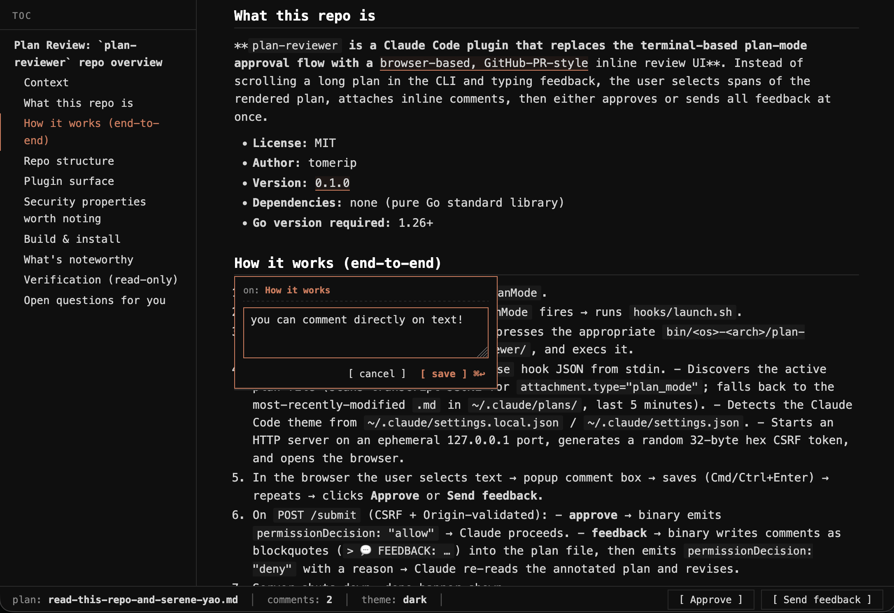

# plan-reviewer

**Review Claude's plans the way you review a pull request — inline, in your browser, with the comments anchored to the exact words you're talking about.**



Claude's plan mode is a wonderful thing: it makes the model commit to an approach *before* it starts editing files, so you can course-correct early. But the feedback loop it ships with is painful. You get a 400-line plan in your terminal, and your only tool is "type a reply." If the plan says something you disagree with on line 37 *and* something else on line 212, your options are:

- Scroll up. Paste a quote. Say "this part — change X." Scroll further. Paste another quote. Say "and this other part — change Y." Hope you got the quotes right.
- Or wave your hands in prose and hope Claude guesses which part of the plan you meant.

Both are bad. Long plans get worse.

**plan-reviewer replaces that with the review experience you already know from GitHub PRs:** the plan opens in your browser, rendered as markdown with a TOC sidebar. Highlight any phrase — a single word, a sentence, a paragraph — type your feedback, hit save, and it sticks to that span like a sticky note. Do that for as many spots as you want. When you're done, you've got two buttons:

- **[ Approve ]** — Claude moves on.
- **[ Send feedback ]** — Claude gets your annotations inlined into the plan and revises it, addressing each comment.

The UI is monospace and terminal-styled, with colors that match your active Claude Code theme (dark, light, ANSI, daltonized — whichever you're running). It feels like Claude Code grew a second window, not like you've been handed off to some other tool.

Install it once, forget about it, then never hand-quote a plan section again.

## Install

```text
/plugin marketplace add tomerip/claude-code-plan-reviewer
/plugin install plan-reviewer@plan-reviewer
```

That's it. Next time Claude finishes a plan and calls `ExitPlanMode`, the review UI opens in your default browser.

## Usage

1. Claude writes a plan, then tries to exit plan mode.
2. The review UI opens at `http://127.0.0.1:<random port>`:
   - Click TOC entries to jump to any section.
   - Select any span of text to attach a comment (⌘↩ to save, Esc to cancel).
3. **[ Approve ]** → lets Claude proceed to its own approval dialog.
4. **[ Send feedback ]** → annotates the plan with `> 💬 FEEDBACK on "<anchor>": …` blockquotes and tells Claude to revise.

## Repo layout

This repo is a single-plugin marketplace:

```
.
├── .claude-plugin/marketplace.json     # marketplace catalog
└── plugins/plan-reviewer/              # the plugin itself
    ├── .claude-plugin/plugin.json
    ├── hooks/                          # PreToolUse:ExitPlanMode → launch.sh
    ├── bin/<os>-<arch>/*.gz            # gzipped per-platform binaries
    ├── cmd/, internal/                 # Go source
    └── ...
```

The plugin README is at [plugins/plan-reviewer/README.md](plugins/plan-reviewer/README.md).

## License

MIT — see [LICENSE](LICENSE).
